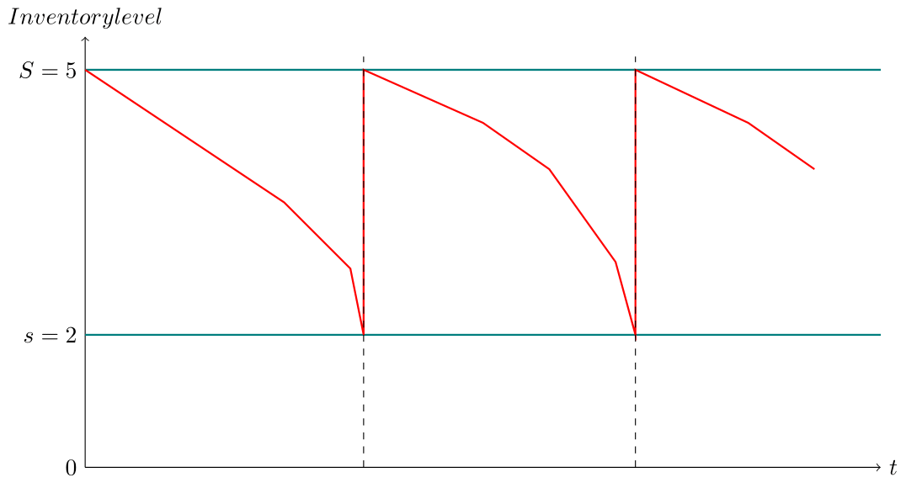
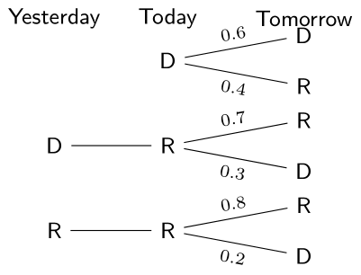
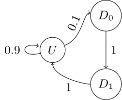

Starting with this post, we will explore the Discrete Time Markov Chain, a type of stochastic process.

Let's first breifly take a look at what a stochastic process is.

## Stochastic Process (SP)

A **stochastic process** is a collection of random variables indexed by time:

$$
\{ X(t) \mid t \in T \}
$$

### State Space ($S$)
- $S$: The set of all possible values that $X(t)$ can take (state space)

  - For **discrete time (DT) SP**:  
    $X_n \in S,\ \forall n$

  - For **continuous time (CT) SP**:  
    $X_t \in S,\ \forall t$

  - Discrete state space / Continuous state space

> *Our main concern with DTMC (Discrete-Time Markov Chain) is the case where the state space is finite and discrete.*

### Index Set

- **DT:**  
  Index set $T = \{ 0, 1, 2, \ldots \} = \mathbb{N}$  
  $X_n,\ n \in \mathbb{N}$, or $X_n$ (the state of the system at $n$)

- **CT:**  
  Index set $T = [0, \infty) = \mathbb{R}^+$  
  $X(t),\ t \in T$, or $X(t)$ (the state of the system at $t$)

### Examples of Stochastic Processes

- Poisson Process (PP)
- Continuous Time Markov Chain (CTMC) (e.g., Queueing models)
- Reliability
- Brownian Motion

### Memory

Consider a discrete-time (DT) stochastic process:

$$
P\{X_{n+1} = j \mid X_n = i,\, X_{n-1} = i_{n-1},\, \ldots,\, X_0 = i_0\}
$$

1. **Infinite memory:**  
   - No possible simplification  
   - $$P\{X_{n+1} = j \mid X_n = i,\, X_{n-1} = i_{n-1},\, \ldots,\, X_0 = i_0\}$$  
   - *Lots of flexibility but overly complicated*

2. **Limited memory:**  
   - $$P\{X_{n+1} = j \mid X_n = i,\, X_{n-1} = i_{n-1},\, \ldots,\, X_{n-k} = i_{n-k}\}$$

3. **No memory:**  
   - $$P\{X_{n+1} = j\}$$  
   - *Simple analysis but little to no modeling flexibility*

> DTMC (Discrete-Time Markov Chain) is a good example of case (2) (**limited memory**).
> This is one reason DTMC is widely used

## Discrete-Time Markov Chain (DTMC)

Let $n \geq 0$, $j, i, i_{n-1}, \ldots, i_0 \in S$ (the state space).

Consider the conditional probability:

$$
\begin{align*}
&P\{\underbrace{X_{n+1} = j}_{\text{Future}} \mid \underbrace{X_n = i}_{\text{Current}},\, \underbrace{X_{n-1} = i_{n-1},\, \ldots,\, X_0 = i_0}_{\text{Past}} \} \\
&= P\{ X_{n+1} = j \mid X_n = i \} \qquad \text{(Markov Property)}\\
&= P\{ X_1 = j \mid X_0 = i \} \qquad \text{(Time Homogeneity)}
\end{align*}
$$

***Markov Property (MP)***

- Only the current state matters; the process "forgets" the past.
- **MP:** *Markov Property*

***Time Homogeneity (TH)***

- Transition probabilities do not depend on time.
- **TH:** *Time Homogeneity*

Therefore, we can denote:

$$
P_{ij} = P\{ X_1 = j \mid X_0 = i \}
$$

which represents the **one-step transition probability from $i$ to $j$**.

> From now on, we limit our discussion to DTMCs that meet time homogeneity condition.

### Transition Matrix

Because of the Markov Property (MP) and Time Homogeneity (TH), all one-step transitions can now be represented in matrix form.

Let $P = [P_{ij}]$ be the transition matrix, where:
- $P_{ij} \geq 0$ for all $i, j$
- $i$: current state (row), $j$: future state (column)

$$
P = \begin{bmatrix}
P_{11} & P_{12} & \cdots \\
P_{21} & P_{22} & \cdots \\
\vdots & \vdots & \ddots
\end{bmatrix}
$$

Each element:
$$
P_{ij} = P\{ X_1 = j \mid X_0 = i \}
$$

The sum of each row equals 1:
$$
\sum_{j \in S} P_{ij} = \sum_{j \in S} P\{ X_1 = j \mid X_0 = i \} = 1
$$

> **Meaning:** The summation of all probabilities (elements) in a row amounts to 1.  
> (This is not necessarily true for columns.)

***Initial Distribution***

The transition matrix only describes the transitions between states; it does not specify the initial probabilities at the starting time. These initial values may or may not be given in modeling DTMCs.

Let $\alpha(i) = P(X_0 = i)$ denote the initial probability of being in state $i$ ($i \in S$).

Properties:
- $\alpha(i) \geq 0$ for all $i \in S$
- $\sum_{i \in S} \alpha(i) = \sum_{i \in S} P(X_0 = i) = P(X_0 \in S) = 1$

## DTMC Modeling

The following are the steps need to be taken in modeling DTMC.

**STEPS**

1. **Specify the model**  
   $X_n$: state as a function of time

2. **Specify the state space**  
   $S$: the set of all possible values each random variable $X_n$ can take

3. **Show that the model is a DTMC**  
   (i.e., show that the Markov Property (MP) and Time Homogeneity (TH) apply)

4. **Specify the transition matrix or diagram**

5. **Specify the initial distribution**: $\alpha = \alpha(i)$  
   (Or state: "No information is provided on the initial distribution.")

Let's move on to some practical examples of DTMC modeling.

### Example 1. - Inventory

**Background**

Since this is not an inventory modeling course, I will provide only a brief explanation.

Among various inventory policies, there is the $(S, s)$ policy. Under this policy, whenever the ending inventory reaches $s$, an order is placed to top up the inventory to $S$. For simplicity, we assume that if an order is placed at the end of the day, the inventory is replenished before the start of the next business day.

Modeling this as a DTMC means that, if there are $i$ items remaining in inventory at the end of a certain day, we are interested in the probability that there will be $j$ items remaining at the end of the next day.

The following graph is the case where we set $S = 5$ and $s = 2$.

#### Step 1. Specify the Model

Let $X_n$ be the **level of inventory** (number of items in stock) at the **end of day $n$**.

Assume:
- $(S, s) = (5, 2)$  
  (Maximum stock $S=5$, reorder point $s=2$)

#### Step 2. Specify the State Space

Let $\mathcal{S} = \{0, 1, 2, 3, 4, 5\}$ denote the **state space** (i.e., all possible inventory levels).

Let $D_n \overset{\mathrm{i.i.d.}}{\sim} \mathrm{Unif}\{0, 1, 2, 3\}$

(discrete uniform random variable; this represents the probability distribution of daily demand)

> **Note:** Here, $\mathcal{S}$ is used to denote the state space, which is distinct from $S$, the maximum inventory level.

**Assumptions:**  
- No backlogging  
- Discrete items  
- Demand is independent from inventory  
- Potential demand is realized at the end of each day

#### Step 3. Check Whether the Model is DTMC

Update rule:
$$
X_{n+1} =
\begin{cases}
\max(0, S - D_{n+1}), & \text{if } X_n < s \\\\
\max(0, X_n - D_{n+1}), & \text{if } X_n \geq s
\end{cases}
$$

- The information of $X_n$ is sufficient to predict $X_{n+1}$ (**Markov Property**).
- The process satisfies **Time Homogeneity** (TH).

$$
P(X_{n+1} = j \mid X_n = i) = P(X_1 = j \mid X_0 = i) \quad (\text{TH})
$$

#### Step 4. Transition Matrix

The columns are tomorrow's ending inventory and the rows are today's ending inventory.

|       |   0   |   1   |   2   |   3   |   4   |   5   |
| :---: | :---: | :---: | :---: | :---: | :---: | :---: |
|   0   |   0   |   0   |  1/4  |  1/4  |  1/4  |  1/4  |
|   1   |   0   |   0   |  1/4  |  1/4  |  1/4  |  1/4  |
|   2   |  2/4  |  1/4  |  1/4  |   0   |   0   |   0   |
|   3   |  1/4  |  1/4  |  1/4  |  1/4  |   0   |   0   |
|   4   |   0   |  1/4  |  1/4  |  1/4  |  1/4  |   0   |
|   5   |   0   |   0   |  1/4  |  1/4  |  1/4  |  1/4  |

or, in matrix form:

$$
P = \begin{bmatrix}
0 & 0 & \frac{1}{4} & \frac{1}{4} & \frac{1}{4} & \frac{1}{4} \\
0 & 0 & \frac{1}{4} & \frac{1}{4} & \frac{1}{4} & \frac{1}{4} \\
\frac{2}{4} & \frac{1}{4} & \frac{1}{4} & 0 & 0 & 0 \\
\frac{1}{4} & \frac{1}{4} & \frac{1}{4} & \frac{1}{4} & 0 & 0 \\
0 & \frac{1}{4} & \frac{1}{4} & \frac{1}{4} & \frac{1}{4} & 0 \\
0 & 0 & \frac{1}{4} & \frac{1}{4} & \frac{1}{4} & \frac{1}{4}
\end{bmatrix}
$$

- Each row sums up to 1.

#### Step 5. Initial Distribution

Let $\alpha(i)$ denote the initial probability that $X_0 = i$.

If the initial state is known (e.g., $X_0 = s$):
$$
\alpha(i) = P(X_0 = i) =
\begin{cases}
1, & \text{if } i = s \\\\
0, & \text{otherwise}
\end{cases}
$$

Or, state: "No information is provided on the initial distribution."

**Note:**  
- If $X_n$ is defined at the **beginning of the day**,  
  - **Pros:** Smaller state space  
  - **Cons:** Harder to formulate the model

---

### Example 2. - Weather

Suppose there are only two states in the weather: Rainy days and Dry days.

- $R$: raining day
- $D$: dry day

(two states)

The transition probabilities are as follow:

#### Step 1. Specify the Model

$X_n$: weather on day $n$

#### Step 2. Specify the State Space

$\mathcal{S} = \{R, D\}$

#### Step 3. Check for Markov Property (MP) and Time Homogeneity (TH)

- $P(X_{n+1} = D \mid X_n = D) = 0.6$
- $P(X_{n+1} = R \mid X_n = D) = 0.4$
- $P(X_{n+1} = D \mid X_n = R, X_{n-1} = D) = 0.3$
- ...

**Markov Property is NOT satisfied:**  
$X_{n+1}$ depends on $X_{n-1}$, not just $X_n$.

**Time homogeneity is satisfied:**  
$$
P(X_{n+2} \mid X_{n+1}=i, X_n=j) = P(X_2 \mid X_1=i, X_0=j), \quad i, j \in \mathcal{S}
$$

$\therefore$ **Not a DTMC**

$\downarrow$

**Alternative approach is needed.**

We can make each state a tuple of (today's weather, yesterday's weather)

#### Step 1': Specify the Model

Let $X_n$ be the weather on day $n$.

Define the process:
$$
Y_n = (X_n, X_{n-1})
$$
where $Y_n$ is the tuple of today’s and yesterday’s weather.

We model the stochastic process as $\{Y_n\}$.

#### Step 2': Specify the State Space

$$
S = \{ (R, R),\ (R, D),\ (D, R),\ (D, D) \}
$$

#### Step 3': Check for Markov Property (MP) and Time Homogeneity (TH)

- $Y_n$: tuple of today’s and yesterday’s states  
- $Y_{n+1}$: tuple of tomorrow’s and today’s states

Because tomorrow’s weather only depends on today’s and yesterday’s weather (not earlier days):

- **Markov Property is satisfied**
- Day numbering is not relevant $\to$ **Time Homogeneity is satisfied**

Therefore,
$$
\{ Y_n \} \text{ is a DTMC.}
$$

#### Step 4: Specify the Transition Probability Matrix

|            | (R, R) | (R, D) | (D, R) | (D, D) |
| :--------: | :----: | :----: | :----: | :----: |
| **(R, R)** |  0.8   |  0.2   |   0    |   0    |
| **(R, D)** |  0.7   |   0    |  0.3   |   0    |
| **(D, R)** |   0    |   0    |  0.4   |  0.6   |
| **(D, D)** |   0    |   0    |  0.4   |  0.6   |

or, in matrix form:

$$
P = \begin{pmatrix}
0.8 & 0.2 & 0 & 0 \\
0.7 & 0 & 0.3 & 0 \\
0 & 0 & 0.4 & 0.6
\end{pmatrix}
$$

#### Step 5: Initial Distribution

No information is given about the initial state, so  
$$
\alpha(i) = P(Y_0 = i)
$$

> So, one way of modeling DTMC is to make a state a tuple or list of events.

---

### Example 3. - Production

- Each machine fails with probability $0.1$
- Repair takes 1 day

#### Step 1: Specify the Model

Let $(X_n)$ be the process, where  
$X_n$: State of the machine at the end of each day  
$U$: up, $D$: down

#### Step 2: Specify the Sample Space

$S = \{U, D\}$

#### Step 3: Check for MP, TH

$$
\begin{aligned}
& P(X_{n+1} = U \mid X_n = D) = 1 \\
& P(X_{n+1} = D \mid X_n = D) = 0 \\
& P(X_{n+1} = D \mid X_n = U) = 0.1 \\
& P(X_{n+1} = U \mid X_n = U) = 0.9 \\
& P(X_{n+1} \mid X_n) = P(X_1 \mid X_0) \implies \text{MP, TH are satisfied}
\end{aligned}
$$

$\{X_n\}$ is a DTMC.

#### Step 4: Specify the Transition Probability Matrix

|       | U   | D   |
| ----- | --- | --- |
| **U** | 0.9 | 0.1 |
| **D** | 1   | 0   |

or, in matrix notation:

$$
P = \begin{pmatrix}
0.9 & 0.1 \\
1 & 0
\end{pmatrix}
$$

#### Step 5: Initial Probability

Let $\alpha(i)$ be the initial probability:
$$
\alpha(i) = P(X_0 = i)
$$

### Example 4. What if it takes two days (or even three days) to repair?

**Approach 1:** $Y_n = (X_n, X_{n-1})$  
**Approach 2:** $S = \{ U, D_0, D_1 \}$  
($D_0$: 0 days of repair completed, $D_1$: 1 day of repair completed: Expand the state space by defining new states!)

We take approach 2 this time. (Note that we took approach 1 for the weather example.)

#### Step 1: Define $X_n$

We did it already.

#### Step 2: Specify the State Space

$$
S = \{ U, D_0, D_1 \}
$$

where  
- $U$: up  
- $D_0$: 0 days of repair completed  
- $D_1$: 1 day of repair completed

#### Step 3: Markov Property and Time Homogeneity

- If in $U$, with probability $0.9$ remain in $U$, with probability $0.1$ go to $D_0$
- If in $D_0$, move deterministically to $D_1$
- If in $D_1$, move deterministically to $U$

This can be represented as:

- $U \xrightarrow{0.9} U$, $U \xrightarrow{0.1} D_0$
- $D_0 \xrightarrow{1} D_1$
- $D_1 \xrightarrow{1} U$

Therefore, MP and TH are satisfied, and $\{ X_n \}$ is a DTMC.

#### Step 4: Transition Probability Matrix

|           |  $U$  | $D_0$ | $D_1$ |
| --------- | :---: | :---: | :---: |
| **$U$**   |  0.9  |  0.1  |   0   |
| **$D_0$** |   0   |   0   |   1   |
| **$D_1$** |   1   |   0   |   0   |

or, in matrix form:

$$
P = \begin{pmatrix}
0.9 & 0.1 & 0 \\
0 & 0 & 1 \\
1 & 0 & 0
\end{pmatrix}
$$

#### Step 5: Initial Distribution

$\alpha(i)$: Not given

> **Note:**  
> Approach 2 dominates Approach 1  
> Why? --> Smaller state space

### Transition Probability Diagram

The above example can be represented by transition probability diagram.

We you take out the probabilities, it is simply called transition diagram.

---

**Credit**\
All content in this post is a digitized version of my own lecture notes taken during *ISYE 6650: Probabilistic Models and Their Applications* (Fall 2024, Georgia Tech, [**Prof. Sigrun Andradottir** (Georgia Tech Link)](https://www.isye.gatech.edu/users/sigrun-andradottir)).
Full credit for the course materials and original explanations belongs to the professor.
