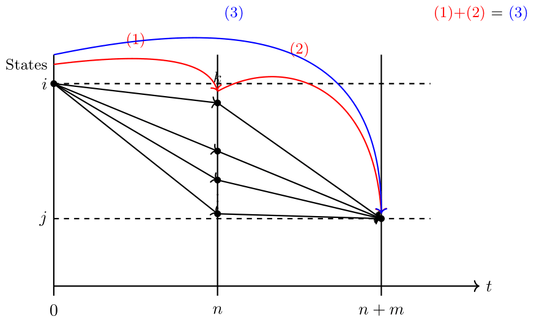

We have learned how to calculate one-step transition probabilities and represent them using matrices and diagrams. But what if we want to express transition probabilities for two, three, or more steps? The answer is simple: if we raise the transition probability matrix to the k-th power, it gives us the k-step transition probabilities. This conclusion follows directly from the Chapman-Kolmogorov Equation. In this post, we will take a closer look at the C-K Equation.

### Definition: m-step transition probability

$P_{ij}^{(m)}$: m-step transition probability from state $i$ to $j$

For all $m \geq 0$, $i, j \in S$.

(We are going to show that this is ultimately the $(i, j)$ element of $P^m$, such that $P$: single-step transition probability matrix)

$$
P_{ij}^{(m)} = P(X_{n+m} = j \mid X_n = i)
$$

or, in particular,

$$
P_{ij}^{(m)} = P(X_m = j \mid X_0 = i)
$$

> remembr time homogeneity?

---

### Definition: Chapman-Kolmogorov Equation

$$
P_{ij}^{(n+m)} = \sum_{k \in S} P_{ik}^{(n)} P_{kj}^{(m)}
$$

for all $m, n \geq 0$, $i, j \in S$.

#### Intuitive Explanation of the Chapman-Kolmogorov (C-K) Equation

This graph provides a visual intuition for the Chapman-Kolmogorov equation:

- Suppose we want the probability of moving from state $i$ to state $j$ in $n+m$ steps.
- Instead of thinking about the whole journey at once, we can "split" the journey at an intermediate time $n$, considering all possible states $k$ the process could be in at time $n$.
- For each possible $k$, we:
    1. Compute the probability of moving from $i$ to $k$ in $n$ steps: $P_{ik}^{(n)}$
    2. Compute the probability of moving from $k$ to $j$ in $m$ more steps: $P_{kj}^{(m)}$
    3. **Multiply** these two probabilities: $P_{ik}^{(n)} \times P_{kj}^{(m)}$

Why do we multiply?  
Because once the process arrives at $k$ at time $n$, **the future evolution from $k$ to $j$ in the next $m$ steps does not depend on how we arrived at $k$**—this is the Markov property.  
Therefore, the two segments ($i \to k$ in $n$ steps and $k \to j$ in $m$ steps) are **independent**, so their probabilities can be multiplied.

Finally, because there are many possible states $k$ the process could visit at time $n$, we **sum over all possible $k$** to account for every possible "split point":

$$
P_{ij}^{(n+m)} = \sum_{k \in S} P_{ik}^{(n)} P_{kj}^{(m)}
$$

**Summary:**  
- Multiply the probabilities for independent segments (due to the Markov property).
- Sum over all possible intermediate states $k$.

This is the essence of the Chapman-Kolmogorov equation.

#### Formal Argument of the Chapman-Kolmogorov (C-K) Equation

The following is the formal argument:

$$
\begin{align*}
P_{ij}^{(m+n)} &= P(X_{n+m} = j \mid X_0 = i) \\
               &= \frac{P(X_{n+m} = j, X_0 = i)}{P(X_0 = i)} \qquad \text{(dcp: definition of conditional probability)} \\
               &= \frac{\sum_{k \in S} P(X_{n+m} = j, X_0 = i, X_n = k)}{P(X_0 = i)} \qquad \text{(LTP: law of total probability, summing over $k \in S$)} \\
               &= \sum_{k \in S} \frac{P(X_{n+m} = j, X_0 = i, X_n = k)}{P(X_0 = i)} \\
               &= \sum_{k \in S} P(X_{n+m} = j \mid X_0 = i, X_n = k) \cdot P(X_n = k \mid X_0 = i) \qquad \text{(chain rule)} \\
               &= \sum_{k \in S} P(X_{n+m} = j \mid X_n = k) \cdot P(X_n = k \mid X_0 = i) \qquad \text{(MP: Markov Property)} \\
               &= \sum_{k \in S} P(X_{m} = j \mid X_0 = k) \cdot P(X_n = k \mid X_0 = i) \qquad \text{(TH: Time Homogeneity)} \\
               &= \sum_{k \in S} P_{kj}^{(m)} \cdot P_{ik}^{(n)}
               & \square
\end{align*}
$$

$$P_{ij}^{(m+n)} = \sum_{k \in S} P_{ik}^{(n)} P_{kj}^{(m)}$$ can be formally argued by the same fashion.

**Side note**

- **LTP (Law of Total Probability):**

    $$
    P(A) = \sum_{d=1}^{k} P(A \cap C_d) = \sum_{d=1}^{k} P(A \mid C_d) P(C_d)
    $$
    Where $\bigcup_{d} C_d = \Omega$ and $C_i \cap C_j = \emptyset$ for all $i \neq j$.

### Connecting to Matrix Powers: The Chapman-Kolmogorov Equation and Induction

From the Chapman-Kolmogorov equation, recall:
$$
P_{ij}^{(m+n)} = \sum_{k \in S} P_{ik}^{(m)} P_{kj}^{(n)}
$$

Let $P^{(1)}$ denote the **1-step transition matrix**, $P^{(m)}$ the **$m$-step transition matrix**, and $P^{(0)} = I$ the identity matrix.  
Define:
- $P^{(m+n)} = [a_{ij}]$,
- $P^{(m)} = [b_{ij}]$,
- $P^{(n)} = [c_{ij}]$,

where $a_{ij} = \sum_{k \in S} b_{ik} c_{kj}$.

By matrix multiplication, this means:
$$
P^{(m+n)} = P^{(m)} P^{(n)}
$$

#### Example:  
For $m = n = 1$,
$$
P^{(2)} = P^{(1)} P^{(1)} = P P = P^2
$$

#### $P^{(m)} = P^m$

By induction:
$$
P^{(m)} = P^m,\quad \forall m \geq 0
$$

***Proof of $P^{(m)} = P^m$ by Mathematical Induction***

1. **Base case:**  
   - $P^{(1)} = P^1 = P$
   - $P^{(0)} = P^0 = I$

2. **Induction hypothesis (IH):**  
   Assume $P^{(n)} = P^n$ for some $n \geq 0$.

3. **Induction step:**  
   By the Chapman-Kolmogorov equation and IH:
   $$
   P^{(n+1)} = P^{(n)} P^{(1)} = P^n P = P^{n+1}
   $$
   Therefore, if the result holds for $n$, it holds for $n+1$.

**Conclusion:**  
By induction, $P^{(m)} = P^m$ for all $m \geq 0$.
Meaning, m-step transition probabilities are represented in $P^m$.

*Notation Recap*
- $P^{(1)}$: 1-step transition matrix
- $P^{(m)}$: $m$-step transition matrix
- $P^{(0)}$: Identity matrix $I$
- $P^{(m)} = [b_{ij}]$, $P^{(n)} = [c_{ij}]$, $P^{(m+n)} = [a_{ij}]$

### Unconditional m-step Transition Probabilities

Through the Chapman-Kolmogorov equation, we have seen that the $m$-step transition matrix is simply the $m$-th power of the one-step transition matrix $P$.
Now, let’s see how we can use this result to calculate $m$-step unconditional probabilities.

Initial probabilities are given as: $\alpha_i = P(X_0 = i)$, for all $i \in S$.

To compute $P(X_n = j)$,

$$
\begin{align*}
P(X_n = j) &= \sum_{i \in S} P(X_n = j,\, X_0 = i) \qquad \text{(LTP)} \\
           &= \sum_{i \in S} P(X_n = j \mid X_0 = i)\, P(X_0 = i) \qquad \text{(dcp)} \\
           &= \sum_{i \in S} \alpha_i\, P_{ij}^{(n)}
\end{align*}
$$

*(by the law of total probability (LTP) and the definition of conditional probability (dcp))*

where:
- $\alpha_i = P(X_0 = i)$
- $P_{ij}^{(n)} = P(X_n = j \mid X_0 = i)$

### Example

Consider the following Markov transition matrix:

$$
P = \begin{pmatrix}
0.6 & 0.4 \\
0.2 & 0.8
\end{pmatrix}
$$

Let the initial distribution be $\alpha_0 = 0.3$, $\alpha_1 = 0.7$.

We are interested in the following probabilities:

**a.** $P(X_6 = 1,\, X_2 = 1 \mid X_0 = 1)$

**b.** $P(X_2 = 1,\, X_6 = 1)$

**c.** $P(X_5 = 1,\, X_3 = 0 \mid X_4 = 0,\, X_2 = 1)$

*Let us solve each in turn below!*

---

#### Solution to (a) $P(X_6 = 1,\, X_2 = 1 \mid X_0 = 1)$ (intuitively)

This can be calculated intuitively using the Markov property:

$$
\begin{align*}
P(X_6 = 1,\, X_2 = 1 \mid X_0 = 1)
= P_{11}^{(2)} \cdot P_{11}^{(4)}
\end{align*}
$$

where $P_{11}^{(2)}$ is the $(1,1)$ entry of $P^2$ (the probability of being in state 1 at time 2 given starting in state 1), and $P_{11}^{(4)}$ is the $(1,1)$ entry of $P^4$ (the probability of being in state 1 at time 4 given starting in state 1).

#### Solution to (a) $P(X_6 = 1,\, X_2 = 1 \mid X_0 = 1)$ (rigorously)

$$
\begin{align*}
P(X_6 = 1,\, X_2 = 1 \mid X_0 = 1) &= \frac{P(X_6 = 1, X_2 = 1, X_0 = 1)}{P(X_0 = 1)} \qquad \text{(dcp)} \\
                                   &= \frac{P(X_6 = 1 \mid X_2 = 1, X_0 = 1) \: P(X_2 = 1, X_0 = 1)}{P(X_0 = 1)} \qquad \text{(dcp)} \\
                                   &= \frac{P(X_6 = 1 \mid X_2 = 1) \: P(X_2 = 1, X_0 = 1)}{P(X_0 = 1)} \qquad \text{(MP)} \\
                                   &= P(X_6 = 1 \mid X_2 = 1) \: P(X_2 = 1 \mid X_0 = 1) \qquad \text{(MP)} \\
                                   &= P(X_4 = 1 \mid X_0 = 1) \: P(X_2 = 1 \mid X_0 = 1) \qquad \text{(TH)} \\
                                   &= P_{11}^{(2)} \cdot P_{11}^{(4)}
\end{align*}
$$

---

#### Solution to (b) $P(X_2 = 1,\, X_6 = 1)$ (intuitively)

$$
\begin{align*}
P(X_2 = 1,\, X_6 = 1) &= P(X_6 = 1,\, X_2 = 1) \\
                      &= P(X_6 = 1,\, X_2 = 1, \, X_0 = 1) + P(X_6 = 1,\, X_2 = 1, \, X_0 = 0) \\
                      &= \alpha_0P_{01}^{(2)} \cdot P_{11}^{(4)} + \alpha_1P_{11}^{(2)} \cdot P_{11}^{(4)}
\end{align*}
$$

#### Solution to (b) $P(X_2 = 1,\, X_6 = 1)$ (rigorously)

$$
\begin{align*}
P(X_2 = 1,\, X_6 = 1)
    & = \sum_{i \in S} P(X_2 = 1, X_6 = 1, X_0 = i) && \text{(LTP: partition by $X_0$)} \\
    & = P(X_2 = 1, X_6 = 1, X_0 = 0) + P(X_2 = 1, X_6 = 1, X_0 = 1) \\
    & = P(X_6 = 1 \mid X_2 = 1, X_0 = 0)\; P(X_2 = 1 \mid X_0 = 0)\; P(X_0 = 0) \\
    & \quad + P(X_6 = 1 \mid X_2 = 1, X_0 = 1)\; P(X_2 = 1 \mid X_0 = 1)\; P(X_0 = 1) && \text{(chain rule and dcp)} \\
    & = P(X_6 = 1 \mid X_2 = 1)\; P(X_2 = 1 \mid X_0 = 0)\; P(X_0 = 0) \\
    & \quad + P(X_6 = 1 \mid X_2 = 1)\; P(X_2 = 1 \mid X_0 = 1)\; P(X_0 = 1) && \text{(MP)} \\
    & = P(X_4 = 1 \mid X_0 = 1)\; P(X_2 = 1 \mid X_0 = 0)\; P(X_0 = 0) \\
    & \quad + P(X_4 = 1 \mid X_0 = 1)\; P(X_2 = 1 \mid X_0 = 1)\; P(X_0 = 1) && \text{(TH)} \\
    & = P_{01}^{(2)}\, P_{11}^{(4)}\, \alpha_0 + P_{11}^{(2)}\, P_{11}^{(4)}\, \alpha_1 \\
\end{align*}
$$

---

#### Solution to (c) $P(X_5 = 1,\, X_3 = 0 \mid X_4 = 0,\, X_2 = 1)$ (rigorously)

$$
\begin{align*}
& P(X_5 = 1,\, X_3 = 0 \mid X_4 = 0,\, X_2 = 1) = \frac{P(X_5 = 1,\, X_3 = 0,\, X_4 = 0,\, X_2 = 1)}{P(X_4 = 0,\, X_2 = 1)} \qquad \text{(dcp)} \\
\end{align*}
$$

Let us first compute the numerator:

$$
\begin{align*}
& P(X_5 = 1,\, X_4 = 0,\, X_3 = 0,\, X_2 = 1) \\
& \qquad = P(X_5 = 1 \mid X_4 = 0,\, X_3 = 0,\, X_2 = 1)\; P(X_4 = 0,\, X_3 = 0,\, X_2 = 1) \qquad \text{(dcp)} \\[1.2ex]
& \qquad = P(X_5 = 1 \mid X_4 = 0)\; P(X_4 = 0 \mid X_3 = 0)\; P(X_3 = 0 \mid X_2 = 1)\; P(X_2 = 1) \qquad \text{(MP, dcp)} \\[1.2ex]
& \qquad = P(X_1 = 1 \mid X_0 = 0)\; P(X_1 = 0 \mid X_0 = 0)\; P(X_1 = 0 \mid X_0 = 1)\; P(X_2 = 1) \qquad \text{(TH)} \\[1.2ex]
& \qquad = P(X_1 = 1 \mid X_0 = 0)\; P(X_1 = 0 \mid X_0 = 0)\; P(X_1 = 0 \mid X_0 = 1)\; ( \alpha_0 P(X_2 = 1 \mid X_0 = 0) + \alpha_1 P(X_2 = 1 \mid X_0 = 1) ) \qquad \text{(TH)} \\[1.2ex]
& \qquad = P_{01}^{(1)}\, P_{00}^{(1)}\, P_{10}^{(1)}\, ( \alpha_0 P_{01}^{(2)} + \alpha_1 P_{11}^{(2)}) \\[1.2ex]
\end{align*}
$$

Now, compute the denominator:

$$
\begin{align*}
& P(X_4 = 0,\, X_2 = 1) \\
& = P(X_4 = 0,\mid X_2 = 1) \; P(X_2 = 1) \qquad \text{(dcp)} \\
& = P(X_2 = 0,\mid X_0 = 1) \; P(X_2 = 1) \qquad \text{(TH)} \\
& = P_{10}^{(2)} \; ( \alpha_0 P_{01}^{(2)} + \alpha_1 P_{11}^{(2)})
\end{align*}
$$

Therefore,

$$
\begin{align*}
P(X_5 = 1,\, X_3 = 0 \mid X_4 = 0,\, X_2 = 1) &= \frac{P(X_5 = 1,\, X_3 = 0,\, X_4 = 0,\, X_2 = 1)}{P(X_4 = 0,\, X_2 = 1)} \\
                                              &= \frac{P_{01}^{(1)}\, P_{00}^{(1)}\, P_{10}^{(1)}\, ( \alpha_0 P_{01}^{(2)} + \alpha_1 P_{11}^{(2)})}{ P_{10}^{(2)} \; ( \alpha_0 P_{01}^{(2)} + \alpha_1 P_{11}^{(2)})} \\
                                              &= \frac{P_{01}^{(1)}\, P_{00}^{(1)}\, P_{10}^{(1)}}{ P_{10}^{(2)}}
\end{align*}
$$

---

**Credit**\
All content in this post are from a digitized version of my own lecture notes taken during *ISYE 6650: Probabilistic Models and Their Applications* (Fall 2024, Georgia Tech, [**Prof. Sigrun Andradottir** (Georgia Tech Link)](https://www.isye.gatech.edu/users/sigrun-andradottir)).
Full credit for the course materials and original explanations belongs to the professor.
