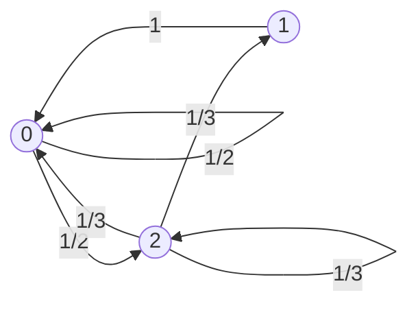
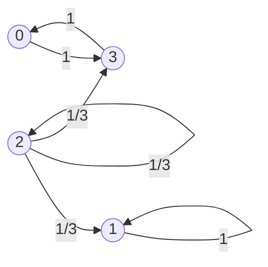
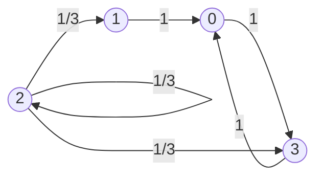

Here is what we have learned so far. First, we studied that a DTMC (Discrete-Time Markov Chain) is a stochastic process in which only the current state influences the future (Markov property). We saw that each one-step transition can be represented using a transition probability matrix and a transition probability diagram.([DTMC I](https://jkang918.github.io/posts/Post3/)) Next, through the Chapman-Kolmogorov equation, we learned that multi-step transitions can be described by taking powers of the transition probability matrix. ([DTMC II](https://jkang918.github.io/posts/Post4/))

So what happens if we take an infinite number of steps? Will the Markov chain eventually visit every state evenly, or are there some states that it will eventually stop visiting altogether? If the chain does visit all (or some) of the states, will the probability of being in each state eventually *converge* to a fixed value over time?

In this post, we’ll learn that **not all states are equal**. As we take the number of steps to infinity, some states may never be visited again, while others are guaranteed to be visited at least once. In other words, each state can have different characteristics.
In the next post, we’ll explore whether the probability of being in each state converges as the number of steps goes to infinity—and if it does, how we can calculate those limiting probabilities.

---

## Definitions

### Accessibility

**Def.** State $j$ is **accessible** from state $i$, if $\exists n \geq 0$ such that $P_{ij}^{(n)} > 0$  
Notation: $i \rightarrow j$

### Communication

**Def.** States $i$ and $j$ **communicate** if $i \rightarrow j$ and $j \rightarrow i$  
Notation: $i \leftrightarrow j$

**Properties of Communication**

1. $\forall i \in S,\; i \leftrightarrow i$  
   $\quad \because\ P_{ii}^{(0)} = 1$  
   (reflexive)

2. If $i \leftrightarrow j$, then $j \leftrightarrow i$  
   (symmetric)

3. If $i \leftrightarrow j$ and $j \leftrightarrow k$, then $i \leftrightarrow k$  
   (transitive)

All three properties are fairly intuitive to understand. In particular, property 3. can be argued more rigorously using the Chapman-Kolmogorov equation.

**Proof of (iii) (Transitivity):**

If $i \leftrightarrow j$, then $\exists\, n \geq 0$ such that $P_{ij}^{(n)} > 0$  
If $j \leftrightarrow k$, then $\exists\, m \geq 0$ such that $P_{jk}^{(m)} > 0$

By the Chapman-Kolmogorov (C-K) equation:
$$
P_{ik}^{(n+m)} = \sum_{\ell \in S} P_{i\ell}^{(n)} P_{\ell k}^{(m)}
$$

In particular,  
$$
P_{ik}^{(n+m)} \geq P_{ij}^{(n)} P_{jk}^{(m)} > 0
$$

Therefore,
$$
P_{ik}^{(n+m)} > 0 \implies i \leftrightarrow k
$$
$\boxed{}$

**Communication as an Equivalence Relation**

- The state space $S$ can be divided into “equivalence classes,” so that each state belongs to exactly one equivalence class, and all states within a given class communicate with each other.

### Reducibility

**Def.**  
A DTMC is **irreducible** if there is only one equivalence class.  
Otherwise, the DTMC is **reducible**.

*Ex 1)*

$$
P =
\begin{bmatrix}
\frac{1}{2} & 0 & \frac{1}{2} \\
1 & 0 & 0 \\
\frac{1}{3} & \frac{1}{3} & \frac{1}{3}
\end{bmatrix}
$$

- **Irreducible**, one equivalence class: <b>{0, 1, 2}</b>

*Ex 2)*

$$
P =
\begin{bmatrix}
0 & 0 & 0 & 1 \\
1 & 0 & 0 & 0 \\
0 & \frac{1}{3} & \frac{1}{3} & \frac{1}{3} \\
1 & 0 & 0 & 0
\end{bmatrix}
$$

- **Reducible**, three equivalence classes: <b>{0, 3}</b>,  <b>{2}</b>, <b>{1}</b>

### Recurrence and Transience

**Def.** 
Recurrence and Transience

Let $f_i$ denote the probability that, **starting from state $i$**, the process will **eventually return to state $i$** at least once.

$$
f_i = P(\text{returning to state } i \mid \text{start in state } i)
$$

- If $f_i = 1$, then **state $i$ is recurrent** (the process is certain to return to $i$).
- If $f_i < 1$, then **state $i$ is transient** (there is a positive probability that the process will never return to $i$).

**Main Propositions for Recurrent and Transient States**

1. **If state $i$ is recurrent and the DTMC starts in state $i$, then the process will return to state $i$ infinitely often, with probability 1 (almost surely).**

   - (i.o. = infinitely often; w.p.1 = with probability one)

2. **If state $i$ is transient, it will be visited only a finite number of times.**
   - In fact, the number of visits to $i$ follows a geometric distribution:
     $$
     P(\text{visit state } i \text{ exactly } n \text{ times}) = f_i^{n-1}(1-f_i) \sim \operatorname{Geom}(f_i)
     $$
     where $f_i$ is the probability of ever returning to $i$ starting from $i$.

3. **In a finite state space DTMC, not all states can be transient.**
   - There must be at least one recurrent state.

4. **Transience and recurrence are class properties.**
   - If $i$ and $j$ communicate ($i \leftrightarrow j$), then both are either recurrent or both are transient.

5. **In an irreducible, finite state space DTMC, all states are recurrent.**
   - (Follows from Propositions 3 and 4.)

Each of these properties can be understood intuitively.
Property 3 is particularly interesting: since the state space is finite but the number of steps is infinite, it is inevitable that the process must eventually return to at least one state. In other words, with only a finite number of states available, it is impossible for the process to “escape forever” without returning somewhere.
Property 4 is also quite intuitive—recurrence and transience are class properties, so if two states communicate, they must share the same behavior.
Together, Properties 3 and 4 make Property 5 easy to understand: in any finite, irreducible Markov chain, all states must be recurrent.

### Absorbing

**Def.**

- **A state $i$ is absorbing** if $P_{ii} = 1$.

### Periodicity

**Def.**

- **A state $i$ is periodic** if there exists an integer $d > 1$ such that for all $n$ with $P_{ii}^{(n)} > 0$, $n$ is divisible by $d$.
    - In other words, you can only return to state $i$ at multiples of $d$ steps.

**Def.**

- **The period of state $i$** is the largest such $d$.
    - If the largest integer dividing all $n$ with $P_{ii}^{(n)} > 0$ is $1$, then state $i$ is **aperiodic**.

**First Hitting Time and Recurrence**

Let $T_i$ denote the **first return time** (or first hitting time) to state $i$:
$$
T_i = \min \{ n > 0 : X_n = i \}
$$

Let $f_i$ be the probability that the process, starting in $i$, **ever returns** to $i$:
$$
f_i = P(T_i < \infty \mid X_0 = i)
$$

$\Rightarrow$ **State $i$ is recurrent if and only if $f_i = 1$.**

Let's clarify this point. The condition $T_i < \infty$ simply means that the process will eventually return to state $i$ at some point in the future. Therefore, state $i$ is recurrent if and only if $f_i = P(T_i < \infty \mid X_0 = i) = 1$. In other words, if we allow the Markov chain to continue for infinitely many transitions, it is certain that state $i$ will be revisited at least once.

### Positive Recurrence, Negative Recurrence

- A recurrent state $i$ is **positive recurrent** if the expected return time is finite:
  
  $$
  \mathbb{E}[T_i \mid X_0 = i] < \infty
  $$

- A recurrent state $i$ is **null recurrent** if the expected return time is infinite:
  
  $$
  \mathbb{E}[T_i \mid X_0 = i] = \infty
  $$

**Propositions**

1. **Positive/null recurrence are class properties:**  
   If two states communicate, then either both are positive recurrent or both are null recurrent.

2. **In a finite state space DTMC, there are no null recurrent states:**  
   In other words, all recurrent states in a finite Markov chain are necessarily positive recurrent.

Even if a state is recurrent, if the state space is infinite, the expected return time to that state can diverge (i.e., become infinite). However, in the context of the finite state space DTMCs that we consider, all recurrent states are necessarily **positive recurrent**—the expected return time is always finite. Therefore, it is not meaningful to discuss null recurrence in our setting. From this point forward, we will focus only on whether states are positive recurrent.

## Comprehensive Example

*Ex 1)*

$$
P = 
\begin{bmatrix}
1/2 & 0 & 1/2 \\
1 & 0 & 0 \\
1/3 & 1/3 & 1/3
\end{bmatrix}
$$

- **Irreducible:** There is only one equivalence class: <b>{0, 1, 2}</b>
- **All states are aperiodic** (i.e., their period is 1).  
  (This is true even if the self-loops are removed!)
- **All states are recurrent** (they are visited infinitely often with probability 1).

*Ex 2)*

$$
P = 
\begin{bmatrix}
0 & 0 & 0 & 1 \\
1 & 0 & 0 & 0 \\
0 & \frac{1}{3} & \frac{1}{3} & \frac{1}{3} \\
1 & 0 & 0 & 0 \\
\end{bmatrix}
$$

- **Reducible:** There are three equivalence (communicating) classes:  
  <b>{0, 3}</b>, <b>{2}</b>, and <b>{1}</b>

- <b>{0, 3}</b>: **Recurrent**, **periodic** (period = 2)
- <b>{2}</b>: **Transient**, **aperiodic**
- <b>{1}</b>: **Recurrent**, **absorbing**, **aperiodic**

