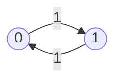

## From n-step Probabilities to Stationary Distribution

In the previous posts, we explored how one-step and multi-step transition probabilities in a Markov chain can be represented by raising the transition probability matrix to the corresponding power. We also learned how to classify states using various criteria such as recurrence, transience, periodicity, and more.

In this post, we move forward to address several key questions:

- **As the number of steps becomes very large, will the Markov chain “settle” in some states?**
- **If so, do the transition probabilities converge to some limiting values?**
- **If they do converge, how can we compute these values?**

When the probability of being in a particular state converges as the number of transitions approaches infinity, this limit is called the **limiting probability**.  
It is also referred to as the **steady state probability** or the **stationary probability**, because it describes the long-run or equilibrium behavior of the Markov chain.

In many Markov chains, regardless of the initial state, the probability distribution over states converges to a unique, stable distribution as time goes to infinity—provided certain conditions are met.

In this post, we will develop the tools to understand, compute, and interpret these limiting or stationary probabilities.

## Limiting, Steady-State, Stationary Probability

Consider a Markov chain with transition matrix

$$
P = \begin{bmatrix}
0.7 & 0.3 \\
0.4 & 0.6
\end{bmatrix}
$$

Repeated multiplication yields

$$
P^2 = \begin{bmatrix}
0.61 & 0.39 \\
0.52 & 0.48
\end{bmatrix}
\quad
P^3 = \begin{bmatrix}
0.5799 & 0.4201 \\
0.4666 & 0.5332
\end{bmatrix}
\quad
P^8 \approx \begin{bmatrix}
0.692 & 0.308 \\
0.692 & 0.308
\end{bmatrix}
$$

As $n \to \infty$, the rows converge to the same vector.

***Key Questions***

1. **When does the transition matrix converge?**  
   (What are the conditions for convergence?)
2. **How do we compute the limiting values?**  
   (How do we compute the steady-state probabilities?)

### Convergence Theorem

**Theorem**

In an **irreducible**, **positive recurrent**, **aperiodic** DTMC,
$$
\lim_{n \to \infty} P_{ij}^{(n)}
$$
exists and **does not depend on $i$**.

> We will not rigorously prove this theorem here, but let’s try to understand its **intuitive meaning**.

---

### Steady-State Probability

Let
$$
\pi_j = \lim_{n \to \infty} P_{ij}^{(n)} \quad (i, j \in S)
$$

Then $\pi_j, \quad (j\in S)$ are the unique solution to
$$
\pi_j = \sum_{i \in S} \pi_i P_{ij}, \; \sum_{j \in S} \pi_j = 1
$$

By law of total probability,

$$
P\{X_n = j\} = \sum_{i \in S} P\{X_n = j \mid X_0 = i\} P(X_0 = i) = \alpha_i P_{ij}^{(n)}
$$

As $n \to \infty$,

$$
\sum_{i \in S} \alpha_i P_{ij}^{(n)} \xrightarrow{n \to \infty} \sum_{i \in S} \alpha_i \pi_j = \pi_j\sum_{i \in S} \alpha_i = \pi_j
$$

$$
\therefore \; P_{ij}^{(n)} \xrightarrow{n \to \infty} \pi_j \tag{1}
$$

Only other hand, we can also derive $\sum_{j \in S} \pi_j = 1$:

$$
1 =  \sum_{j \in S} P\{X_n = j\} \xrightarrow{n \to \infty} \sum_{j \in S} \pi_j
$$

$$
\therefore \; \sum_{j \in S} \pi_j = 1 \tag{2}
$$

Lastly, by law of total probability,

$$
P\{X_n = j\} = \sum_{i \in S} P_{ij} P\{X_{n-1} = i\}
$$

Taking the limit as $n \to \infty$,

$$
\pi_j = \sum_{i \in S} P_{ij} \pi_i \tag{3}
$$

Here, we call $\pi_j, \; \forall j \in S$;

- limiting probability
- steady-state probability
- staitionary probability ($\pi_i = \alpha_i, \; \forall i \in S$)

Recall the conditions:

1. irreducible, 2. positive recurrent, 3. aperiodic

The third condition, aperiodicness is not required for the two definitions other than limiting probability and we will also learn why interpreting the result as a limiting probability is not particularly useful in practice, and why the definition of steady-state probability is generally preferred.

But first, *we move onto **how to compute** $\pi_j$, $j \in S$.*

## How to Compute the Stationary Distribution $\pi_j$

$\pi_j$ is a unique solution to a system of linear equations (SLE).

*Suppose there are $N$ states (so $N$ variables, $\pi_i$, $i \in S$).*
This gives us $(N+1)$ equations:

$$
\begin{cases}
\sum_{j \in S} \pi_j = 1 & \text{(1 equation)} \\\\
\sum_{i \in S} \pi_i P_{ij} = \pi_j & \text{($N$ equations, linearly dependent)}
\end{cases}
$$

- Since these $N$ equations are linearly dependent, **we drop one** (usually the last or any one of them).

So in expanded form, the equations are:

$$
\begin{aligned}
\pi_1 + \pi_2 + \cdots + \pi_N &= 1 \\\\
\pi_1 P_{11} + \pi_2 P_{21} + \cdots + \pi_N P_{N1} &= \pi_1 \\\\
\pi_1 P_{12} + \pi_2 P_{22} + \cdots + \pi_N P_{N2} &= \pi_2 \\\\
&\vdots \\\\
\pi_1 P_{1(N-1)} + \pi_2 P_{2(N-1)} + \cdots + \pi_N P_{N(N-1)} &= \pi_{N-1} \\\\
\pi_1 P_{1N} + \pi_2 P_{2N} + \cdots + \pi_N P_{NN} &= \pi_N \qquad \rightarrow \text{drop this}
\end{aligned}
$$

or equivalently:

Given $N$ equations:
$$
\begin{cases}
\sum_{j \in S} \pi_j = 1 \\\\
\sum_{i \in S} \pi_i P_{ij} = \pi_j \quad \text{(after dropping one)}
\end{cases}
$$
$\quad$→ Solve and get $\pi_j$'s.

**Example 1.**

Suppose
$$
P = \begin{bmatrix}
0.7 & 0.3 \\\\
0.4 & 0.6
\end{bmatrix}
$$

Set up the system:

$$
\pi_0 + \pi_1 = 1
$$

$$
0.7 \pi_0 + 0.4 \pi_1 = \pi_0
$$

or equivalently,
$$
-0.3 \pi_0 + 0.4 \pi_1 = 0
$$
*(drop one equation for linear dependence)*

Now, in matrix form:
$$
\begin{bmatrix}
-0.3 & 0.4 \\\\
1 & 1
\end{bmatrix}
\begin{bmatrix}
\pi_0 \\\\
\pi_1
\end{bmatrix}
=
\begin{bmatrix}
0 \\\\
1
\end{bmatrix}
$$

So, solving the system, we get:
$$
\pi_0 = \frac{4}{7}, \quad \pi_1 = \frac{3}{7}
$$

---

## Revisiting the Interpretations of $\pi_j$

Among the conditions:

1. irreducible, 2. positive recurrent, 3. aperiodic

let's see what happens the third condition is not met.

**Example 2.** Periodic Markov Chain (Period 2)

$$
P =
\begin{bmatrix}
0 & 1 \\
1 & 0
\end{bmatrix}
$$

$\{0,\, 1\}$: periodic, period $=2$

$$
P^{(0)} =
\begin{bmatrix}
1 & 0 \\
0 & 1
\end{bmatrix}, \quad
P^{(1)} =
\begin{bmatrix}
0 & 1 \\
1 & 0
\end{bmatrix}, \quad
P^{(2)} =
\begin{bmatrix}
1 & 0 \\
0 & 1
\end{bmatrix}, \quad
P^{(3)} =
\begin{bmatrix}
0 & 1 \\
1 & 0
\end{bmatrix}, \ldots
$$

$$
P^{(n)} =
\begin{cases}
I & \text{if $n$ is even} \\
P & \text{if $n$ is odd}
\end{cases}
\qquad (\text{$I$ is the identity matrix})
$$

$$
\lim_{n \to \infty} p_{ij}^{(n)} \text{ does not exist.}
$$

Starting state now comes into play. And the limiting probabilities do noe exist as it never converges to a certain state with such limiting probability.

However, if we are interested in the **long-run average fraction of time spent in a state**, then we can say that would be $1/2$ for each state.

We recall the three interpretations of $\pi_j$ (stationary probability):

1. Steady-State (S-S) Probability  
2. Limiting Probability  
3. Stationary Probability  
   (independent of start state)

The interpretation of S-S probability is:

**Long-run (l-l-n) average fraction of time spent in state $i$**

Mathematically,

$$
\pi_j = \lim_{n \to \infty} \frac{\text{the number of visits to state $j$ throughout $n$ transitions}}{n}
$$

If we add "expected" in the above,  
the interpretation still holds even in the presence of periodicity:

$$
\pi_j = \lim_{n \to \infty} \mathbb{E} \left[ \frac{\text{the number of visits to state $j$ throughout $n$ transitions}}{n} \right]
$$

**Example 2. (Continued)**

For the 2-state periodic chain,

$$
P = \begin{bmatrix}
0 & 1 \\
1 & 0
\end{bmatrix}
$$

The stationary distribution is:

$$
\pi_0 = \pi_1 = 0.5 \qquad \text{(intuitively makes sense)}
$$

The stationary distribution must satisfy:

$$
\pi_0 + \pi_1 = 1
$$

and

$$
\begin{cases}
\pi_0 \cdot 0 + \pi_1 \cdot 1 = \pi_0 \\\\
\pi_0 \cdot 1 + \pi_1 \cdot 0 = \pi_1
\end{cases}
\implies
\begin{cases}
\pi_1 = \pi_0 \\
\pi_0 + \pi_1 = 1
\end{cases}
\implies
\pi_0 = \pi_1 = 0.5
$$

> Takeaway: Interpreting $\pi_j$'s as steady-state probability has given practical usage, "fraction of time", which does not depend of the aperiodicness condition.

## Cost Calculation

In the last section of this post, we are going to study how to calculate state-based costs and transition based costs of a given system. 

Because we know the average time spent in each state and the average transition probability to other states, if costs are assigned either to each state or to each transition, we can compute the overall expected cost of the system. This will become even clearer in the practical example that follows.

### State-based Costs

For each $i \in S$, let $cc(i)$ be the expected cost **per unit time** the DTMC spends in state $i$.

Then,
- **Long-run average state-based costs per unit time:**

$$
\sum_{i \in S} c(i) \pi_i
$$

### Transition-based Costs

For $i, j \in S$, let $c(i, j)$ be the expected cost associated with the **transition from $i$ to $j$**.

Then,
- **Long-run average transition-based costs per unit time:**

$$
\sum_{i \in S} \sum_{j \in S} c(i, j)\, \pi_i\, P_{ij}
$$

Note:
- $c(i) = \sum_{j \in S} c(i, j) P_{ij}$
- $c(i, j) = c(i)$, for $i, j \in S$ (if costs are only state-based)

---

### Example 1. (Continued)

$$
P = \begin{bmatrix}
0.7 & 0.3 \\
0.4 & 0.6
\end{bmatrix}
\implies \pi_0 = \frac{4}{7},\quad \pi_1 = \frac{3}{7}
$$

- **State 0:** Machine down
- **State 1:** Machine up
- **Time unit:** Day

When the machine is up:
- Number of parts produced per day: $0, 1, 2$ with probabilities $0.3, 0.5, 0.2$

Each part can be sold at \$200.

- **Operating cost:** \$50 per day
- **Cost of repair person:** \$100 per day (paid when called, i.e., in state 0)
- **Expected cost of parts per repair:** \$75

> **Question:** What is the daily profit?

### Solution

#### Revenue

Expected number of parts produced per day:

$$
[0 \times 0.3 + 1 \times 0.5 + 2 \times 0.2] \times (200) \times \pi_1
$$

- $[0 \times 0.3 + 1 \times 0.5 + 2 \times 0.2]$: expected number of parts produced per day
- $200$: Sales price per part
- $\pi_1$: Steady-state probability machine is up

#### Costs

$$
1 \times 50 
+ \pi_0 \times 100 
+ \pi_0 P_{01} \times 75
$$

- $1 \times 50$: Operating cost per day
- $\pi_0 \times 100$: Steady-state probability machine is down $\times$ cost of repair per day (state 0)
- $\pi_0 P_{01} \times 75$: Probability of being in state 0 and moving to state 1 (pay at the beginning of repair) $\times$ expected cost of parts per repair

### Daily Profit

$$
\text{Daily Profit} = \text{Revenue} - \text{Costs}
$$

We can assume the payment is made at the beginning of repair then the below term is used instead.

- $\pi_1 P_{10}$

---

**Credit**\
All contents in this post are from a digitized version of my own lecture notes taken during *ISYE 6650: Probabilistic Models and Their Applications* (Fall 2024, Georgia Tech, [**Prof. Sigrun Andradottir** (Georgia Tech Link)](https://www.isye.gatech.edu/users/sigrun-andradottir)).
Full credit for the course materials and original explanations belongs to the professor.
