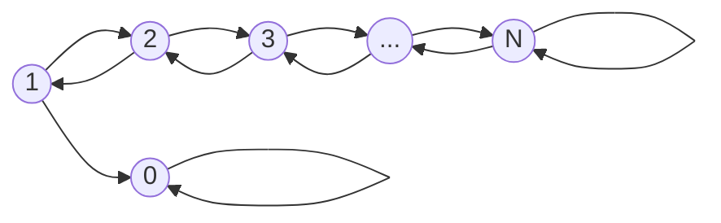
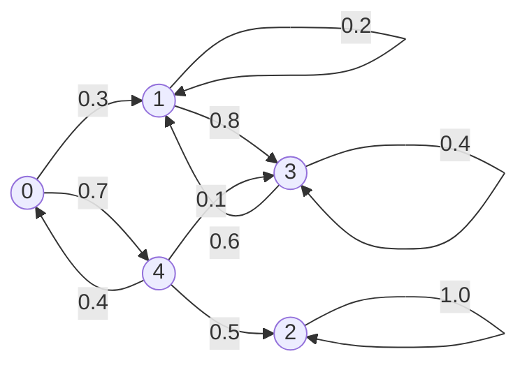

## First Step Analysis

First-step analysis is a technique used in Markov chains to compute the probability or expected value of future events by conditioning on the first step taken from the current state.  
It’s based on the **law of total probability** and the **Markov property**, which states that the future behavior of the process depends only on the present state and not on the past.

## Gambler's Ruin

Gamber's Ruin is one famous example for first step analysis.

**Probelm Description**

A gambler starts with an initial fortune of $i$ dollars and plays a game where:
- Each bet is for USD1.
- The probability of winning USD1 is $p$, and the probability of losing USD1 is $q = 1 - p$.
- Trials are independent.
- The gambler **stops** when they either:
  - Reach the target fortune $N$ (success),
  - Lose all their money (ruin).

Let $X_n$ be the gambler's fortune at time $n$. Then $\{X_n\}$ is a **discrete-time Markov chain** with states $\{0, 1, \dots, N\}$.

States $0$ and $N$ are **absorbing states**.

**Transition Diagram**

Once the money the gambler holds hits zero, he lost the game. Once the money the gambler holds hits $N$, he won the game.

**Goal**

Let $P_i = P(\text{absorbed at } N \mid \text{initial state } i)$, for $0 \leq i \leq N$.

We want to find $P_i$ using **first-step analysis**.

$P_i$ means the winning probability of the gambler with him starting with USD$i$.

**Derivation (Using First-Step Analysis)**

Boundary conditions:
- $P_0 = 0$
- $P_N = 1$

For $0 < i < N$, the recurrence relation is:

$$
P_i = p P_{i+1} + q P_{i-1}
$$

We defined $P_i = P(\text{absorbed in state } N \mid \text{State } i)$, for $0 < i < N$.

By first-step analysis:

$P_i = P(\text{wins first bet}) \cdot P_{i+1} + P(\text{loses first bet}) \cdot P_{i-1}$

That is,

$P_i = p \cdot P_{i+1} + q \cdot P_{i-1}$

Multiply both sides by 1:

$(p + q) P_i = p P_{i+1} + q P_{i-1}$

Since $p + q = 1$, this simplifies to:

$p P_{i+1} + q P_{i-1} = P_i$

Rewriting:

$q (P_i - P_{i-1}) = p (P_{i+1} - P_i)$

Thus:

$P_{i+1} - P_i = \dfrac{q}{p}(P_i - P_{i-1})$

---

Now expand recursively:

$P_2 - P_1 = \dfrac{q}{p}(P_1 - P_0) = \dfrac{q}{p} P_1$  (since $P_0 = 0$)

$P_3 - P_2 = \dfrac{q}{p}(P_2 - P_1) = \left( \dfrac{q}{p} \right)^2 P_1$

$P_4 - P_3 = \left( \dfrac{q}{p} \right)^3 P_1$

⋮

$P_N - P_{N-1} = \left( \dfrac{q}{p} \right)^{N-1} P_1$

---

Add up all the differences:

$P_N - P_0 = \left( \dfrac{q}{p} + \left( \dfrac{q}{p} \right)^2 + \cdots + \left( \dfrac{q}{p} \right)^{N-1} \right) P_1$

Therefore:

$P_N = \left[ \sum_{k=1}^{N-1} \left( \dfrac{q}{p} \right)^k \right] P_1$

This is a geometric series:

$P_N = \left[ \dfrac{(q/p)(1 - (q/p)^{N-1})}{1 - (q/p)} \right] P_1 = \dfrac{1 - (q/p)^N}{1 - (q/p)} P_1$

Given $P_N = 1$, solve for $P_1$:

$P_1 = \dfrac{1 - (q/p)}{1 - (q/p)^N}$

---

General form:

$P_i = \sum_{k=0}^{i-1} \left( \dfrac{q}{p} \right)^k P_1 = P_1 \sum_{k=0}^{i-1} \left( \dfrac{q}{p} \right)^k$

So finally:

$P_i = \dfrac{1 - (q/p)^i}{1 - (q/p)^N}$

---

**Final Result**

$$
P_i =
\begin{cases}
\dfrac{1 - \left( \frac{q}{p} \right)^i}{1 - \left( \frac{q}{p} \right)^N}, & \text{if } p \ne q \\
\\
\dfrac{i}{N}, & \text{if } p = q = 0.5
\end{cases}
$$

Note that first-step analysis allowed us to exploit recursive relations.

---

## Back to First-step analysis

Now let's see some generalized results from first-step analysis.

### Law of Total Probability

Let $\{C_i\}$ be a partition of the sample space:

$$
P(A) = \sum_i P(A \mid C_i) \cdot P(C_i)
$$

### Bayes’ Rule

$$
P(A \mid B) = \frac{P(A \cap B)}{P(B)}
= \frac{\sum_i P(A \cap B \cap C_i)}{P(B)}
= \frac{\sum_i P(A \mid B \cap C_i) \cdot P(B \cap C_i)}{P(B)}
$$

So,

$$
P(A \mid B) = \sum_i P(A \mid B \cap C_i) \cdot P(C_i \mid B)
$$

### Law of Iterated Expectation

$$
E[X] = E_Y \left[ E[X \mid Y] \right]
\quad \text{and} \quad
E[X \mid Y] = E_Z \left[ E[X \mid Y, Z] \mid Y \right]
$$

---

### Application to Markov Chains

Let $\{X_n\}$ be a discrete-time Markov chain (DTMC).

We want to compute:

$$
P(A \mid X_0 = i)
$$

Break this using conditioning on the next state $X_1 = j$:

$$
P(A \mid X_0 = i)
= \sum_{j \in S} P(A \mid X_1 = j, X_0 = i) \cdot P(X_1 = j \mid X_0 = i)
$$

By the Markov property:

$$
= \sum_{j \in S} P(A \mid X_1 = j, X_0 = i) \cdot P_{ij}
$$

Similarly, for expectation:

$$
E[A \mid X_0 = i]
= \sum_{j \in S} E[A \mid X_1 = j, X_0 = i] \cdot P_{ij}
$$

## Steady-state analysis of *reducible* DTMC

Let the transition matrix $P$ be:

$$
P =
\begin{bmatrix}
0 & 0.3 & 0 & 0 & 0.7 \\
0 & 0.2 & 0 & 0.8 & 0 \\
0 & 0 & 1 & 0 & 0 \\
0 & 0.6 & 0 & 0.4 & 0 \\
0.4 & 0 & 0.5 & 0.1 & 0 \\
\end{bmatrix}
$$

**State Classification: 3 equivalent classes**

- ${2}$: positive recurrent (self-absorbing)
- $\{0, 4\}$: transient
- $\{1, 3\}$: positive recurrent (cyclic)

Transition probability diagram:

### Long-run expected time

Let $\pi_{i,j}$ be the **expected long-run average time spent in state $j$**, given that the chain starts in state $i$.

We define the matrix:

$$
\Pi = [\pi_{i,j}] = 
\begin{bmatrix}
0 & P_0 \cdot \pi_1^*  & (1 - P_0) \cdot 1  & P_0 \cdot \pi_3^* & 0 \\
0 & \pi_1^* & 0 & \pi_3^* & 0 \\
0 & 0 & 1 & 0 & 0 \\
0 & \pi_1^* & 0 & \pi_3^* & 0 \\
0 & P_4 \cdot \pi_1^*  & (1 - P_4) \cdot 1  & P_4 \cdot \pi_3^* & 0 \\
\end{bmatrix}
$$

where 

$$
P_i = P(\text{absorbed in } \{1, 3\} \mid X_0 = i)
$$

Let's get into why the steady-state probability matrix looks like above.

#### Observations:

- **State 2 is self-absorbing**, so:
  
  $$
  \pi_{2,2} = 1, \quad \pi_{2,j} = 0 \text{ for } j \ne 2
  $$

Hence the third row of the matrix, $\Pi$ above:

$$
\begin{bmatrix}
0 & 0 & 1 & 0 & 0 \\
\end{bmatrix}
$$

- **States 1 and 3 form a closed communicating class.**
  So, treat states $\{1, 3\}$ as an irreducible subchain and compute the stationary distribution 
  $$
  \pi_1^*, \; \pi_3^*
  $$
  for that subchain.

From the submatrix over $\{1, 3\}$:

$$
P^* =
\begin{bmatrix}
0.2 & 0.8 \\
0.6 & 0.4 \\
\end{bmatrix}
$$

$$
\pi_1^* + \pi_3^* = 1 \\
0.2 \cdot \pi_1^* = 0.6 \cdot \pi_3^*
$$

Substitute:

$$
\pi_1^* = \frac{3}{7}, \; \pi_3^* = \frac{4}{7}
$$

When the transition times go to infinity, with the starting states of $1$ or $3$, you will simply stay within the subchain forever. Hence, 

$$
\begin{bmatrix}
0 & \pi_1^* & 0 & \pi_3^* & 0 \\
\end{bmatrix}
$$

for the second and fourth row of the matrix.

---

- **States 0 and 4 are transient states.**
  
When the transition times are put to infinity, it would endup being out of the class and be absorbed in states 1 or 3.

We use **first-step analysis** to compute the probability of eventual absorption in class $\{1, 3\}$.

As we know,

$$
P_i = P(\text{absorbed in } \{1, 3\} \mid X_0 = i)
$$

From earlier:

- $P_1 = P_3 = 1$, $P_2 = 0$

$$
\begin{align*}
P_i &= P(\text{absorbed in } \{1, 3\} \mid X_0 = i)
    &= \sum_{j \in S} P(A \mid X_1 = j, X_0 = i) \cdot P_{ij}
\end{align*}
$$

For $i = 0$:

$$
P_0 = 0.3 \cdot P_1 + 0.7 \cdot P_4 \\
$$

For $i = 4$:

$$
P_4 = 0.4 \cdot P_0 + 0.5 \cdot P_2 + 0.1 \cdot P_3 \\
$$

Hence,

$$
P_0 = \frac{185}{360}, \; P_4 = \frac{11}{360}
$$

$$
\pi_{0,1} = P_0 \cdot \pi_1^*, \: \pi_{0,3} = P_0 \cdot \pi_3^*
$$

$$
\pi_{4,1} = P_4 \cdot \pi_1^*, \: \pi_{4,3} = P_4 \cdot \pi_3^*
$$

The interpretation is as follow:

When you start at the state 0, at some point during many transitions you will end up in either the subchain of state 1 and 3 or state 2. In the first case, you will spend some time in state 1 and 3, in the other case, you will get stuck in state 2 forever. Hence the first row of the matrix:

$$
\begin{bmatrix}
0 & P_0 \cdot \pi_1^*  & (1 - P_0) \cdot 1  & P_0 \cdot \pi_3^* & 0 \\
\end{bmatrix}
$$

The same goes for state 4.

---

**Credit**\
All contents in this post are from a digitized version of my own lecture notes taken during *ISYE 6650: Probabilistic Models and Their Applications* (Fall 2024, Georgia Tech, [**Prof. Sigrun Andradottir** (Georgia Tech Link)](https://www.isye.gatech.edu/users/sigrun-andradottir)).
Full credit for the course materials and original explanations belongs to the professor.
