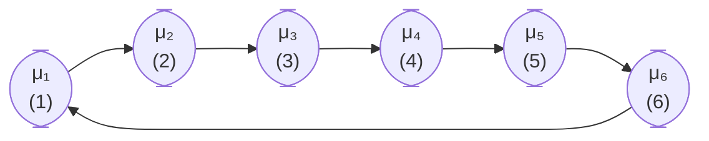

In one of the previous posts: [**Stochastic Process > 2. Discrete Time Markov Chain I** (Example 3)](https://jkang918.github.io/posts/Post3/), we explored a method of incorporating the concept of time into a Discrete-Time Markov Chain (DTMC) by expanding the state space. For example, consider a machine that can either be in a "Normal" or "Failure" condition. If it takes two days to repair the machine when it breaks down, we can model this by introducing three separate states: "Normal", "Under Repair (Day 1)", and "Under Repair (Day 2)", ensuring that each state represents a fixed, standardized time duration (e.g., one day).

However, there's an alternative approach: instead of artificially expanding the state space, we can incorporate the actual time duration directly into the model. In this case, the "Normal" state may last for one day on average, while the "Under Repair" state may last for two days. This modeling framework is known as a Semi-Markov Process.

## Semi-Markov Process (SMP)

Let $X(t)$ be the state of the system at time $t$.

- The process moves between states according to a DTMC with transition probability matrix $P$.
- The expected time per visit to state $i \in \mathcal{S}$ is denoted by $\mu_i$.

Assume $P$ is irreducible and positive recurrent.

Compute $\pi_j$ for all $j \in \mathcal{S}$ as in ordinary DTMC using the steady-state equation (SSE).

Then, the *long-run fraction of time the SMP spends in state $j$* is given by:

$$
\frac{\pi_j \mu_j}{\sum_{k \in \mathcal{S}} \pi_k \mu_k}
$$

This expression is a probability distribution function (pdf), so it adds up to 1.

The denominator is the total time spent in all states, the numerator is that for a certain state.

---

### Example

Consider the following transition diagram:

Each transition happens with probability 1. Then the long-run fraction of time spent in state $j$ is:

$$
\frac{\pi_j \mu_j}{\sum_{k \in \mathcal{S}} \pi_k \mu_k}
= \frac{\frac{1}{6} \cdot \mu_j}{\frac{1}{6}\mu_1 + \frac{1}{6}\mu_2 + \frac{1}{6}\mu_3 + \frac{1}{6}\mu_4 + \frac{1}{6}\mu_5 + \frac{1}{6}\mu_6}
= \frac{\mu_j}{\mu_1 + \mu_2 + \mu_3 + \mu_4 + \mu_5 + \mu_6}
$$

$\mu_j$ stands for average time spent in each state.

## Cost Calculation in SMP

Let $c(j)$ be the expected cost per unit time spent in state $j$.

Let's compare how the closed form formulae for state-based cost and transition based cost differ from those of DTMC. We covered DTMC formulas in here:
[**Stochastic Process > 5. Discrete Time Markov Chain IV**](https://jkang918.github.io/posts/Post7/)

### State-based cost  
Long-run average state-based cost per unit time:

- **DTMC**:
  $$
  \sum_{j \in \mathcal{S}} \pi_j \, c(j)
  $$

- **SMP**:
  $$
  \frac{\sum_{j \in \mathcal{S}} \pi_j \mu_j \, c(j)}{\sum_{k \in \mathcal{S}} \pi_k \mu_k}
  $$

Let $c(i, j)$ be the expected cost associated with a transition from state $i$ to $j$.

### Transition-based cost  
Long-run average transition-based cost per unit time:

- **DTMC**:
  $$
  \sum_{i \in \mathcal{S}} \sum_{j \in \mathcal{S}} c(i, j) \, \pi_i P_{ij}
  $$

- **SMP**:
  $$
  \sum_{i \in \mathcal{S}} \sum_{j \in \mathcal{S}} c(i, j) \cdot \frac{\pi_i}{\sum_{k \in \mathcal{S}} \pi_k \mu_k} \cdot P_{ij}
  $$

Note that there is no $\mu_i$ in the numberator

### Example (continued):

Given:
$$
P = \begin{bmatrix}
0.7 & 0.3 \\\\
0.4 & 0.6
\end{bmatrix}, \quad \pi_0 = \frac{4}{7}, \quad \pi_1 = \frac{3}{7}
$$

- **State 0:** Machine down
- **State 1:** Machine up
- **Time unit:** Day
- **Let $\mu_0 = 2$, $\mu_1 = 1$**

When the machine is up:
- Number of parts produced per day: $0, 1, 2$ with probabilities $0.3, 0.5, 0.2$

Each part can be sold at \$200.

- **Operating cost:** \$50 per day
- **Cost of repair person:** \$100 per day (paid when called, i.e., in state 0)
- **Expected cost of parts per repair:** \$75

> **Question:** What is the daily profit?

#### Revenue:

$$
\underbrace{\left[ (0 \times 0.3) + (1 \times 0.5) + (2 \times 0.2) \right]}_{\text{expected number of parts produced per day}} \times \underbrace{200}_{\text{sale price per unit}} \times \underbrace{\pi_1}_{\text{steady state prob of machine being up}}
$$

- (expected # of parts produced per day)
- $\times$ sales price per part
- $\times$ steady-state prob. machine is up  
→ **Term (1)**

#### Costs:

$$
\underbrace{1}_{\text{everyday}} \times \underbrace{50}_{\text{operating cost}} + \underbrace{\pi_0}_{\text{steady state prob of machine being down}} \times \underbrace{100}_{\text{cost of repair per day}} + \underbrace{\pi_0}_{\text{steady state prob of machine being down}} \times \underbrace{P_{01}}_{\text{prob of transitioning from state 0 to 1}} \times \underbrace{75}_{\text{parts per repair}}
$$

- Daily op. cost: $1 \times 50$
- Repair cost: $\pi_0 \times 100$
- Spare parts: $\pi_0 P_{01} \times 75$  

→ **Term (2)**

#### Daily Profit:

$$
\text{Daily Profit} = \text{Revenue (1)} - \text{Costs (2)}
$$

#### Long-run average profit per unit time (days):

$$
\frac{1}{\pi_0 \mu_0 + \pi_1 \mu_1}
\left[
\text{(1)} \times \mu_1
-
\left\{
\pi_0 \times 100 \times \mu_0 + \pi_1 P_{10} \times 75
\right\}
\right] - 50
$$

- $\frac{1}{\pi_0 \mu_0 + \pi_1 \mu_1}$: total time spent in the system.
- $\text{(1)} \times \mu_1$: revenue times time spent in state 1, machine being up. (state-based)
- $\pi_0 \times 100 \times \mu_2$: cost times time spent in state 0, machine being down (state-based)
- $\pi_1 P_{10} \times 75$: transition based cost
- $50$: operating cost incurs regardless of states. In fact, $50 = \frac{50 \pi_0 \mu_0 + 50 \pi_1 \mu_1}{\pi_0 \mu_0 + \pi_1 \mu_1}$. Technically it's also state-based.

Compare it with the cost calculation we did in the [DTMC case](https://jkang918.github.io/posts/Post7/).

> Remark: Isn't it easy now that we went through DTMC? Just add the concept of time and SMP can be understood very easily.

---

**Credit**\
All contents in this post are from a digitized version of my own lecture notes taken during *ISYE 6650: Probabilistic Models and Their Applications* (Fall 2024, Georgia Tech, [**Prof. Sigrun Andradottir** (Georgia Tech Link)](https://www.isye.gatech.edu/users/sigrun-andradottir)).
Full credit for the course materials and original explanations belongs to the professor.
