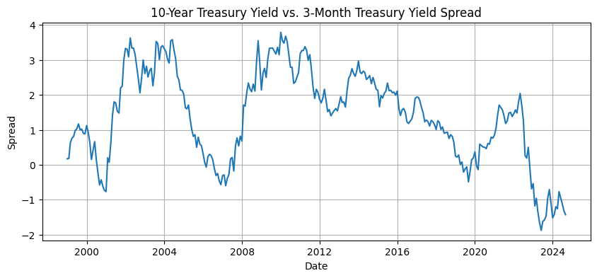
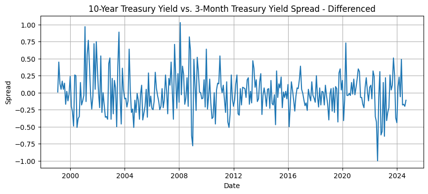
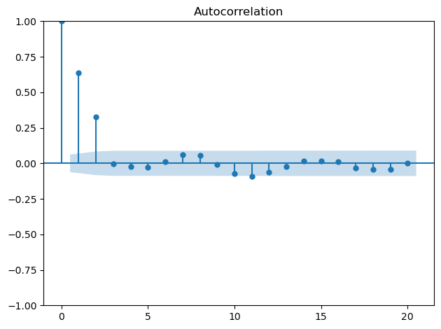
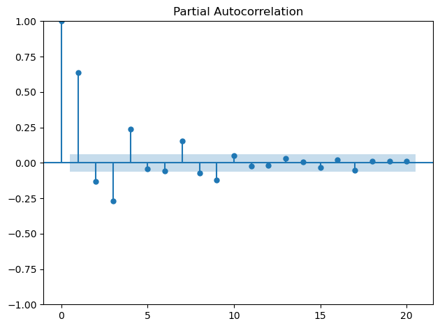
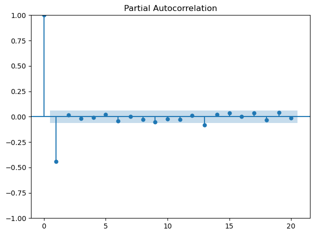
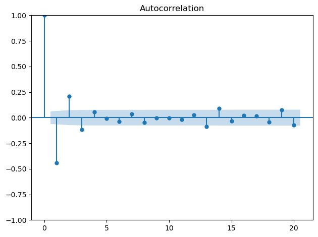
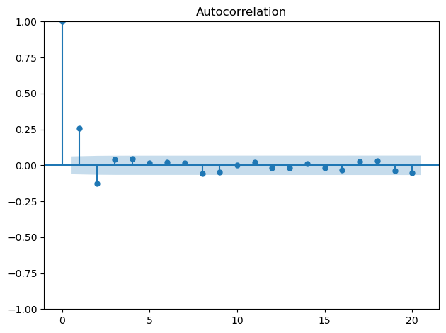
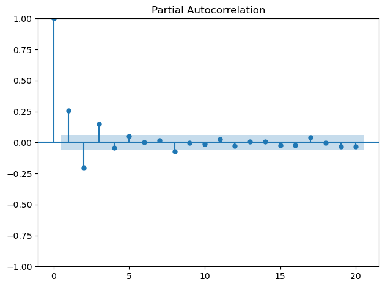

**Note**
- "Stationary" means "Weak Stationary" in this post unless otherwise stated.
- Weak Staiontionary $\iff$ Ergodic for 2nd momenets. (It is known)
- If $\sum_{j=0}^{\infty} \lvert \gamma_j \rvert < \infty$, then $y_t$ is ergodic for 1st moments. (It is known)

Error term(s) is said to follow **white noise** if,

1. $E[\varepsilon_t] = 0$
2. $\mathrm{Var}(\varepsilon_t) = \sigma^2$
3. $\mathrm{Cov}(\varepsilon_t, \varepsilon_\tau) = 0, \text{ where } t \neq \tau$


## Overview of Box-Jenkins Method

Box-Jenkins method is a ***systemic approach to ARIMA forecasting*** consisting of four steps.

**Step 1. Data Transformation**

Through explanatory data analysis (e.g., visualization), you check for stationarity for input data. If they turn out to be non-stationary, you have to transform them to ensure stationarity. Some examples of transformation are as follow: differencing, logarithm, normalization, taking out seasonality or cyclicity, and others.

**Step 2. Identification**

Observe AutoCorrelation Function (ACF, hereafter) and Partial AutoCorrelation Function (PACF, hereafter) to identify the model (e.g., AR(1), MA(1), ARMA(2,4), ARIMA(2, 2, 1)).

**Step 3. Estimation & Selection**

For a group of candidate models identified in the previous step, run estimation (e.g., MLE) to determin on the coefficients in each model. Compare the model performances based on information criteria such as AIC.

**Step 4. Diagnostic Checking**

Check whether the error terms are white noise in the final model selected in the previous step based on the information criteria. If it turns out **not** to be white nosie, go back to the previous step and select the next best model and run diagnostic checking process on that one. 


## Step 1. Data Transformation

One good way to see whether a variable is stationary is to draw a chart. Recall the definition of weak stationarity:

  1. $E[y_t] = \mu$  
  2. $\text{Var}(y_t) = \gamma_0 < \infty$ (constant)  
  3. $\text{Cov}(y_t, y_{t-j}) = \gamma_j < \infty$ (depends only on lag $j$)  

It suggests that for a stationary data, you are expected to see a line that oscillates around the long-term mean.

The following two charts are on the Treasury 10Y-3M spread data that I extracted using fredapi in Aug 2024.





You can easily see the first original data do not meet stationarity conditions. On the other hand, when it is differenced, it seems weak stationarity conditions are met.

There are other more formal statistical methods to determine the stationarity of the data. Most famous statistical test is Augmented Dickey-Fuller test, in short ADF test. I will cover these formal statistical tests in a later post.

If you choose to difference the data $d$ times, that $d$ will get fed into your model identification process as one of the parameters in ARIMA(p, d, q).

## Step 2. Identification

In the model identification step, we observe visualizations of ACF (AutoCorrelation Function) and PACF (Partial AutoCorrelation Function) to identify the model specification.


### Conclusion

**To summarize:**

- If the ACF cuts off at lag $k$ while PACF decays, the process is likely AR(p) with $p = k$.

- If the PACF cuts off at lag $k$ while ACF decays, the process is likely MA(q) with $q = k$.

- If both the ACF and PACF decay, it is likely ARMA(p, q). But we cannot determine $p$ nor $q$ just with ACF and PACF charts. Generate possible lists of (p, q)s and select the model in step 3.

- As noted in step 1, if differencing is required, then the number of differncing is used for $d$ in ARIMA(p, d, q).

Let's briefly go through why we came to this conclusion.

### ACF, PACF

**Def. ACF**

$$
\rho(k) = \frac{\gamma(k)}{\gamma(0)}, \quad \text{where } \gamma(0) = \mathrm{Var}(y_t) \text{ and } \gamma(k) = \mathrm{Cov}(y_t, y_{t-k})
$$

> ACF is the correlation between $y_t$ and $y_{t-k}$ including both direct and indirect effects. In other words, the autocorrelation with linear dependence of $y_t$ on $y_{t-k}$ through the between terms ($y_{t-1}, \; \cdots \; y_{t-k+1}$) are included.

**Def. PACF**

$$
\phi_{k, k} = \mathrm{Corr}(y_t - \hat{y_t}, y_{t-k} - \hat{y_{t-k}}), \quad (k \geq 2)
$$

$$
\phi_{1, 1} = \mathrm{Corr}(y_t, y_{t-1}), \quad (k = 1)
$$

where $y_t$ and $y_{t-k}$ are linear combinations of $\\{y_{t-1} \; \cdots \; y_{t-k+1}\\}$ that minimizes the mean squared error of $y_t$ and $y_{t-k}$ respectively.

> PACF is the correlation between $y_t$ and $y_{t-k}$ excluding both indirect effects. In other words, the autocorrelation with linear dependence of $y_t$ on $y_{t-k}$ through the between terms ($y_{t-1}, \; \cdots \; y_{t-k+1}$) are excluded.

> Credit: I refered to the wikipedia page for [Partial autocorrelation function](https://en.wikipedia.org/wiki/Partial_autocorrelation_function) for PACF part.

### ACF and PACF in AR, MA, and ARMA

#### MA(q)

**ACF cuts off after lag q**

In the [previous post](https://jkang918.github.io/posts/Post12/), wwe went over the autocovariance, $\gamma(k)$ of MA(q):

$$
\gamma_j =
\begin{cases}
(\dots \rightarrow \text{ square terms of } \beta_i)\sigma^2, & j \leq q \\
0, & j > q
\end{cases}
$$

Therefore the ACF is:

- For $j \leq q$:
$$
\rho_j = \gamma_j / \gamma_0 \qquad \text{(specification can be deduced from above)} 
$$

- For $j > q$:
$$
\rho_j = 0
$$

**PACF decays**

It is known that "if $\phi_{1, 1} \geq 0$, the partial autocorrelation oscillates to $0$ and if $\phi_{1, 1} \leq 0$, the partial autocorrelation geometrically decays to $0$." Actual derivation of these results is out of the scope of the post.

> Reference: [Wikepedia Partial autocorrelation function](https://en.wikipedia.org/wiki/Partial_autocorrelation_function)

**Conclusion: Use ACF to determine $q$**

#### AR(p)

**ACF decays**

In the [previous post](https://jkang918.github.io/posts/Post12/), wwe went over the autocovariance, $\gamma(k)$ of AR(p):

$$
\gamma_j = \alpha_1 \gamma_{j-1} + \alpha_2 \gamma_{j-2} + \cdots + \alpha_p \gamma_{j-p}
$$

Normalize this and we get the ACF:

$$
\rho_j = \alpha_1 \rho_{j-1} + \alpha_2 \rho_{j-2} + \cdots + \alpha_p \rho_{j-p}
$$

We can solve this with lag operator but that is out of the scope of the post. Solve the recursive relation and we come to the conclusion that as the order (or lag) increases, the autocorrelation decays geometrically.

Note that there is no exact reason to exactly set $p$ as where the $\rho_j$ becomes insignificant. We only showed $\rho_j$ geometrically decreases. So in a way, we picking $p$ at a level where $\hat{\rho_j}$ becomes insignicant is a **heuristic**.

**PACF cuts off after lag p**

It is known that "the partial autocorrelation for an AR(p) model is nonzero for lags less than or equal to p and 0 for lags greater than p." Actual derivation of these results is out of the scope of the post.

> Reference: [Wikepedia Partial autocorrelation function](https://en.wikipedia.org/wiki/Partial_autocorrelation_function)


**Conclusion: Use PACF to determine $p$**

#### ARMA(p, q)

ARMA model's ACF and PACF behaviors are the mix of two.

So both ACF and PACF decays to $0$.

**Conclusion: Use ACF to determine $p$ and PACF to determine $p$**


### Exercise

Source Code Reference: *Time Series Forecasting in Python by Marco Peixeiro, Ch 4 to 6*.

```python
from statsmodels.tsa.arima_process import ArmaProcess
from statsmodels.graphics.tsaplots import plot_acf, plot_pacf
import numpy as np
import matplotlib.pyplot as plt
```

#### Example: MA(2)

$$
y_t = 0.8 * \varepsilon_{t–1} +  0.65 * \varepsilon_{t–1} + \varepsilon_t
$$

```python
ar2 = np.array([1, 0, 0])
ma2 = np.array([1,0.8, 0.65])
ARMA_0_2 = ArmaProcess(ar2, ma2).generate_sample(nsample=1000)
```
**ACF cuts off after lag 2**

```python
plot_acf(ARMA_0_2, lags=20);
 
plt.tight_layout()
```




**...while PACF decays**

```python
plot_pacf(ARMA_0_2, lags=20);
 
plt.tight_layout()
```



#### Example: AR(1)

$$
y_t = 0.45 * y_{t–1} + \varepsilon_t
$$

```python
ar1 = np.array([1, 0.45])
ma1 = np.array([1,0])
ARMA_1_0 = ArmaProcess(ar1, ma1).generate_sample(nsample=1000)
```


**PACF cuts off after lag 1**

```python
plot_pacf(ARMA_1_0, lags=20);
 
plt.tight_layout()
```




**...while ACF decays**

```python
plot_acf(ARMA_1_0, lags=20);
 
plt.tight_layout()
```



#### Example: ARMA(1, 1)

$$
y_t = 0.45 * y_{t–1} + 0.8 * \varepsilon_{t–1} + \varepsilon_t
$$

```python
ar1 = np.array([1, 0.45])
ma1 = np.array([1,0.8])
ARMA_1_1 = ArmaProcess(ar1, ma1).generate_sample(nsample=1000)
```

**Cannot use ACF to determine lag**

```python
plot_acf(ARMA_1_1, lags=20);
 
plt.tight_layout()
```



**Cannot use PACF to determine lag**

```python
plot_pacf(ARMA_1_1, lags=20);
 
plt.tight_layout()
```



For ARMA(p, q), we determine $p$ and $q$ in step 3.

## Step 3. Estimation & Selection

In this step, for each candidate model based on the possible sets of p and q identified (or not identified unfortunately) through the ACF and PACF in the previous step, we estimate the coefficients and then select the model with the best information criterion.

Estimation is skipped because it is covered in the [previous post](https://jkang918.github.io/posts/Post12/) covering AR, MA, ARMA, ARIMA. MLE is ususally used.

Selection of the best model is made based on the **information criteria**.

Let's breifly go through two most widely used information criteria.

**AIC - Akaike Information Criteria**

$$
\mathrm{AIC} = −2 \ln(\hat{\mathrm{L}})+2k
$$

where $\hat{\mathrm{L}}$ is maximum likelihood value while $k$ is the number of parameters.

**BIC - Bayesian Information Criteria**

$$
\mathrm{BIC} = −2 \ln(\hat{\mathrm{L}})+ k \ln(n)
$$

where $\hat{\mathrm{L}}$ is maximum likelihood value while $k$ is the number of parameters. $n$ is the size of sample.

Note that they are both penalty scores; the lower the better. 

## Step 4. Diagnostic Checking

Check whether the error term is white noise in the selected model. Several ways are there including Ljung-Box test, which is used to test for autocorrelation. The null hypothesis here is residuals' autocorrelation is $0$ so if p-value is too small, it is suggested that the error term is not white noise. In this case, go back to step 3, pick the next best model, do the step 4. again. The iteration continues until the selected model's error terms are white noise. (or more precisely, there is no evidence that they are not white noise.)

## For Further Studies

For more extensive and general modeling process along with practical codes, refer to *[Time Series Forecasting in Python](https://www.manning.com/books/time-series-forecasting-in-python-book) by Marco Peixeiro*.
